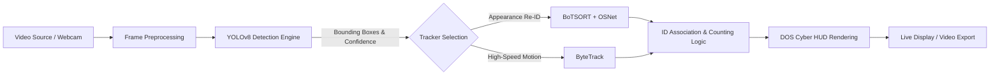

# DOS · Dikshu AI Crowd Analytics & Vision Counter 👁️⚡

[](https://www.python.org/)
[](https://github.com/ultralytics/ultralytics)
[](https://github.com/mikel-brostrom/yolo_tracking)
[-purple.svg)](#)
[](LICENSE)

An intelligent, real-time computer vision system for **crowd counting**, **head/person detection**, and **multi-object tracking** (MOT) developed by **Dikshu (DOS)**. Powered by state-of-the-art deep learning architectures including **YOLOv8**, **BoTSORT** with **OSNet Re-Identification (Re-ID)**, and **ByteTrack**.

---

## 🌟 Key Features

- 🎯 **High-Precision Head & Person Detection**: Optimized YOLOv8 models (`yolo-head-detection.pt` and standard YOLOv8 variants) capable of identifying individuals in dense, occluded environments.
- 🔄 **Advanced Multi-Object Tracking (MOT)**:
  - **BoTSORT + OSNet Re-ID**: Appearance-based feature extraction (`osnet_x0_25_msmt17.pt`) to maintain persistent track IDs across occlusions and re-entries.
  - **ByteTrack**: Low-latency, high-frame-rate association for real-time video processing.
- 📊 **Real-time DOS HUD Telemetry**:
  - Live active detections count & cumulative unique visitor tally.
  - Dynamic ID color palette with tracking bounding boxes.
  - FPS counter, frame telemetry, and status indicators.
- 🎥 **Versatile Input / Output**:
  - Live Webcams & USB cameras (Device 0, 1, etc.).
  - Video file inputs (`.mp4`, `.avi`, `.mov`, `.mkv`).
  - Automated annotated video export and analytical logs.

---

## 🏗️ System Architecture & Pipeline



---

## 📁 Repository Structure

```
├── crowd-counting/
│   ├── input_videos/             # Sample raw test videos (Canteen, Class)
│   ├── output_videos/            # Rendered video exports
│   ├── all-algo.ipynb            # Algorithm comparison & experiments
│   ├── bytetrack-main.py         # ByteTrack pipeline implementation
│   ├── counting.ipynb            # Jupyter notebook for step-by-step counting
│   ├── main.py                   # BoTSORT + YOLOv8 pipeline implementation
│   ├── opencv-webcam.ipynb       # Live webcam test notebook
│   ├── osnet_x0_25_msmt17.pt     # OSNet Re-Identification weights
│   └── yolo-head-detection.pt    # Specialized head detection YOLO weights
├── dos_crowd_counter.py          # Unified DOS CLI & Interactive Runner
├── requirements.txt              # Python project dependencies
├── .gitignore                    # Git ignore rules
└── README.md                     # Project documentation
```

---

## 🚀 Quick Start & Installation

### 1. Clone the Repository
```bash
git clone https://github.com/Dikshu143644/DOS-Dikshu-Crowd-Counter.git
cd DOS-Dikshu-Crowd-Counter
```

### 2. Set Up Virtual Environment (Recommended)
```bash
# Windows
python -m venv venv
venv\Scripts\activate

# Linux / macOS
python3 -m venv venv
source venv/bin/activate
```

### 3. Install Dependencies
```bash
pip install -r requirements.txt
```

---

## 💻 Usage & CLI Options

### Run Unified DOS Crowd Counter

```bash
# Run on default webcam with BoTSORT
python dos_crowd_counter.py --source 0 --tracker botsort

# Run on a video file with ByteTrack
python dos_crowd_counter.py --source crowd-counting/lab.mp4 --tracker bytetrack

# Run with Head Detection model and save output video
python dos_crowd_counter.py --source crowd-counting/input_videos/Canteen.mp4 --model crowd-counting/yolo-head-detection.pt --save
```

---

## 🔬 Algorithms Explained

### 1. YOLOv8 (Ultralytics)
YOLOv8 provides fast single-stage object detection with high mean Average Precision (mAP). In this project, we employ head detection weights trained specifically on top-down and dense crowd environments where full bodies might be obscured.

### 2. BoTSORT with OSNet
BoTSORT integrates motion estimation (Kalman Filter + Camera Motion Compensation) with deep Re-ID features extracted via the lightweight OSNet network (`osnet_x0_25_msmt17.pt`). This enables reliable track ID persistence even when people temporarily step out of frame or walk behind obstacles.

### 3. ByteTrack
ByteTrack utilizes low-score detection bounding boxes to preserve tracks in heavy occlusion without introducing noticeable compute overhead.

---

## 👨‍💻 Author & Credits

- **Project Lead / Developer**: **Dikshu (DOS)**
- **GitHub**: [@Dikshu143644](https://github.com/Dikshu143644)
- **Built for**: Advanced Real-time Computer Vision & Crowd Analytics

---

## 📜 License

This project is licensed under the MIT License. Feel free to use, modify, and distribute for academic and professional computer vision applications.
